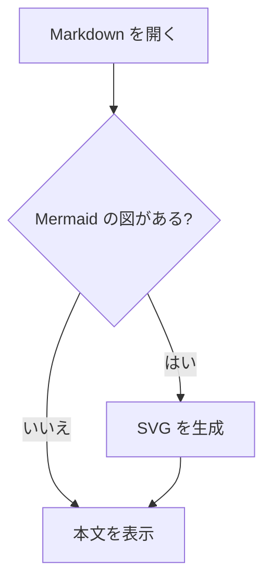
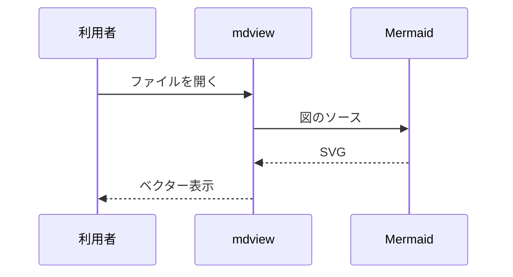

# Mermaid 表示確認

## フローチャート

```mermaid
flowchart TD
    A[Markdown を開く] --> B{Mermaid の図がある?}
    B -->|はい| C[SVG を生成]
    B -->|いいえ| D[本文を表示]
    C --> D
```

## シーケンス図

```mermaid
sequenceDiagram
    participant User as 利用者
    participant App as mdview
    participant Engine as Mermaid
    User->>App: ファイルを開く
    App->>Engine: 図のソース
    Engine-->>App: SVG
    App-->>User: ベクター表示
```

## エラー時も本文を表示

```mermaid
flowchart TD
    A[閉じていないラベル
```

この段落は図の生成失敗に影響されません。
